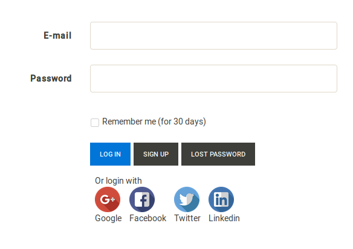

**Authest** is an example of how to show private and social login on one page using web2py. 

### Prerequisites:

***

in order for this to work you will need to install four additional modules:

    python -m pip install oauth2
    python -m pip install linkedin
    python -m pip install python-linkedin
    python -m pip install facebook-sdk

You will also need to configure your app for each of social networks. 
You can find links for configuration pages in [modules/authclients.py](modules/authclients.py)

    

